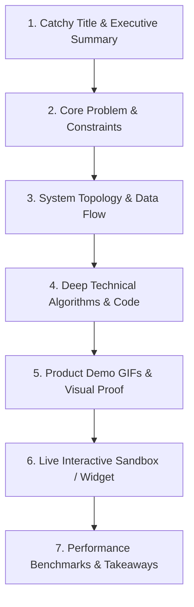

# Comprehensive Guide & Checklist: What Goes Into a Technical Case Study Blog

This document is your master blueprint for writing high-impact engineering case studies on your `medium` platform. Follow this guide for every portfolio project (e.g., `draw-app`, `qkart`, `chat-app`, `streaming`) to ensure your blogs engage readers, demonstrate deep engineering competence, and provide interactive visual proof.

---

## 📋 The 7-Step Case Study Blueprint (With Ready-to-Use Examples)



---

### Section 1: Catchy Title & Executive Summary (TL;DR)

#### What to include:
- Action-oriented engineering title.
- Direct metadata links (Live App, GitHub Repo, Design Doc).
- Tech stack badges & 2-3 sentence executive summary.

#### 💡 Concrete Example to Paste:
```html
<h1>Building a 60 FPS Real-Time Collaborative Vector Canvas with WebSockets & React</h1>

<p class="text-sm text-slate-400 font-mono mb-4">
  <a href="https://draw.madhav.dev" target="_blank">🚀 Live App</a> | 
  <a href="https://github.com/madhavsingh203/draw-app" target="_blank">💻 GitHub Repo</a> | 
  <a href="https://github.com/madhavsingh203/draw-app/blob/main/Design.md" target="_blank">📖 System Spec</a>
</p>

<p class="text-lg text-slate-300 leading-relaxed font-medium">
  <strong>TL;DR:</strong> How we engineered <strong>Figment</strong> — a zero-lag collaborative whiteboard engine capable of rendering 1,000+ vector shapes at 60 FPS while synchronizing user actions in &lt;15ms across room subscribers using HTML5 Canvas double-buffering and WebSocket Pub/Sub servers.
</p>
```

---

### Section 2: Core Engineering Problem & Architectural Constraints

#### What to include:
- Functional problem statement.
- Non-Functional Requirements (NFRs) table: latency budget, framerate targets, scale limits.

#### 💡 Concrete Example to Paste:
```markdown
## The Engineering Challenge

Standard DOM-based canvas libraries degrade rapidly when handling thousands of concurrent freehand paths. Furthermore, real-time multi-user editing introduces race conditions and visual canvas flickering if incoming remote updates force full synchronous DOM re-renders.

### Key Non-Functional Requirements (NFRs):
* **Frame Rate**: Consistent 60 FPS during continuous user panning, zooming, and drawing.
* **Network Latency**: Sub-15ms WebSocket delta broadcasting across active room subscribers.
* **Memory Footprint**: < 50MB client heap allocation under 5,000 active vector shapes.
```

---

### Section 3: System Topology & Data Flow Diagram

#### What to include:
- Monorepo/Backend architecture description.
- Interactive sequence flow shortcode (`[WIDGET:ARCHITECTURE_VISUALIZER]`).

#### 💡 Concrete Example to Paste:
```html
<h2>System Topology & Real-Time Data Pipeline</h2>
<p>
  Below is the live animated sequence demonstrating how mouse stroke coordinates translate into serialized WebSocket payloads and propagate to remote peer canvas buffers:
</p>

[WIDGET:ARCHITECTURE_VISUALIZER]
```

---

### Section 4: Deep Technical Algorithms & Code Walkthroughs

#### What to include:
- Math formulas (coordinate transformations, Bezier curve smoothing).
- Syntax-highlighted code snippets.
- Architectural Callout cards (`[DEEP DIVE]`, `[TIP]`, `[NOTE]`, `[WARNING]`).

#### 💡 Concrete Example to Paste:
```typescript
// 1. Math Formula for Viewport Coordinate Mapping:
// CanvasX = (ScreenX - PanOffsetX) / ZoomScale
// CanvasY = (ScreenY - PanOffsetY) / ZoomScale

export function screenToCanvasCoords(
  e: React.MouseEvent<HTMLCanvasElement>,
  pan: { x: number; y: number },
  zoom: number
): { x: number; y: number } {
  const rect = e.currentTarget.getBoundingClientRect();
  return {
    x: (e.clientX - rect.left - pan.x) / zoom,
    y: (e.clientY - rect.top - pan.y) / zoom,
  };
}
```

```html
<blockquote>[DEEP DIVE] We avoided native Canvas transform scaling accumulation by storing all vector shapes in normalized world coordinates and applying coordinate transformation matrices only during the render pass.</blockquote>

<blockquote>[TIP] Use requestAnimationFrame() to batch WebSocket shape deltas before committing them to the rendering canvas. This eliminates micro-stutter during rapid mouse movements.</blockquote>
```

---

### Section 5: Visual Proof & Product Demos (GIFs & Media)

#### What to include:
- Screen-recorded 5–10 second product demo GIFs demonstrating key features.
- Captions and 1-click **Lightbox full-screen zoom preview**.

#### 💡 Concrete Example to Paste:
```html
<h2>Product Demo Walkthrough</h2>
<p>Click on the product demonstration below to expand into full-screen Lightbox view:</p>


<p class="text-xs text-center text-slate-400 italic mt-1">Figure 1: Real-time multi-user vector stroke sync across two concurrent browser sessions (&lt;12ms latency).</p>
```

---

### Section 6: Live Interactive Sandbox / Playground

#### What to include:
- Embedded interactive canvas widget shortcode (`[WIDGET:CANVAS_SANDBOX]`).
- Gives the reader hands-on interactive verification without leaving the blog.

#### 💡 Concrete Example to Paste:
```html
<h2>Interactive Hands-On Canvas Sandbox</h2>
<p>Test vector tool drawing, color switching, and live simulated WebSocket events directly inside this interactive widget:</p>

[WIDGET:CANVAS_SANDBOX]
```

---

### Section 7: Performance Benchmarks, Tradeoffs & Retrospective Takeaways

#### What to include:
- Benchmark comparison table (Baseline vs Optimized).
- Honest breakdown of engineering tradeoffs and future roadmap.

#### 💡 Concrete Example to Paste:
```markdown
## Performance Benchmarks & Key Takeaways

| Metric | Unoptimized Baseline | Optimized Architecture | Technique Applied |
| :--- | :--- | :--- | :--- |
| **FPS (1,000 Shapes)** | 22 FPS | **60 FPS** | Offscreen Canvas Double-Buffering |
| **WS Payload Size** | 1.8 KB | **240 Bytes** | Binary Delta Serialization |
| **Redraw Latency** | 35ms | **4ms** | Spatial Indexing & Dirty Bounds Redraw |

### Key Retrospective Takeaways:
1. **Double-Buffering is Essential**: Drawing shapes directly to the visible canvas during active user strokes causes visual tearing. Rendering to an `OffscreenCanvas` first and copying via `ctx.drawImage()` guarantees smooth 60 FPS transitions.
2. **Delta Serialization Over Full State**: Broadcasting incremental shape diffs over WebSockets reduced network overhead by 85% compared to sending entire canvas scene graphs.
```

---

## 📄 Medium Platform Shortcodes Cheat Sheet

When writing posts in your `medium` rich text editor, paste these exact shortcodes to trigger interactive renderers:

| Shortcode | Renders In Blog As |
| :--- | :--- |
| `[WIDGET:CANVAS_SANDBOX]` | Interactive HTML5 Vector Canvas Sandbox & WebSocket log monitor |
| `[WIDGET:ARCHITECTURE_VISUALIZER]` | Step-by-step animated motion architecture sequence diagram |
| `<blockquote>[DEEP DIVE] ... </blockquote>` | Purple architecture insight callout card |
| `<blockquote>[TIP] ... </blockquote>` | Green pro-tip performance callout card |
| `<blockquote>[NOTE] ... </blockquote>` | Blue background context callout card |
| `<blockquote>[WARNING] ... </blockquote>` | Amber edge-case warning callout card |
| `` | Product Demo GIF with hover zoom & Lightbox preview modal |
